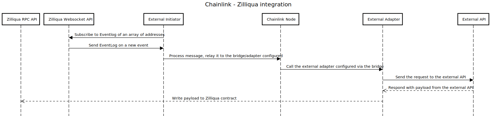

# Chainlink to Zilliqa Integration

This project aims to integrate the Zilliqa blockchain with the Chainlink Oracle infrastructure so Oracle data can be requested and retrieved on the Zilliqa blockchain.

## Modules

The project is a monorepo containing all components needed to retrieve data from an external data provider via a REST Api.

### The External Initiator (EI)

[The External Initiator](./external-initiator/README.md) is a server process that can watch contract events via rpc or websocket. The process is spun up, configured with the addresses to watch and once an event is emitted, in our case on the Zilliqa blockchain, the event is retrieved as JSON. The event is then relayed to a registered job definition in the chainlink node. The job relays the data to the nodes' bridge which calls the external adapter. The events on the relay are in Chainlink [standard format](https://docs.chain.link/docs/developers#requesting-data) and are flattened on the EI side. E.g.the json params on the Notification message are flattened to key/value pairs. 

### The Chainlink Node

[The Chainlink core node](https://github.com/smartcontractkit/chainlink) is configured in the docker-compose file. It contains the necessary environment configuration to spin up a container running the core node.
The core node relays requests from the external initator to the external adapter in this context, besides the general features it provides such features as configuration persistence etc. The core node requires a DB for it which is configured in the compose file as well.

### The External Adapter (EA)

In the current configuration [the external adapter](./external-adapters/README.md) is called by the core node and sends a request to the external adapter, the EA calls the REST API that requests data from a public REST API.
The EA receives the response from the public REST API and initiates a call with the Zilliqa client which executes a transaction on the Zilliqa blockchain thereby completing the call graph. The EA's are based on the NodJS tempates for adapters and can be found [here](https://github.com/thodges-gh/CL-EA-NodeJS-Template).

## Starting the modules

Starting the infrastructure is a complete process, e.g., all required configurations are executed. You can change most of them in the run file, which let's you change the bridge configuration that defines the external api address, and the addresses it needs to listen to via the [Zilliqa websocket API](https://dev.zilliqa.com/docs/dev/dev-tools-websockets/#subscribe-event-log)

### Prerequisites

- Currently you need to run the code on Linux.
- [Install docker-compose](https://docs.docker.com/compose/install/)

### Commands

Start the infrastructure:
```bash
./run  
```
Stop the infrastructure:
```bash
./stop
```

## Details

### Sequence Diagram call graph



### Setup

### Run

The setup process (included in the run file) bootstraps the components and creates several integration links while it sets up the infrastructure:
- It creates an external_initiator.env file to share the credentials between the external initiator and the chainlink node
- Builds the yarn packages and installation
- Builds the docker images

The run process configures the chainlink node finally with the credentials of the external initiator and the configuration of the components for the integration:
- Reset old docker volumes and start docker compose
- Add the external initiator configuration to the chainlink node via the nodes' rest api.
- Startup the external initiator
- Login to the chainlink node
- Add the bridges configuration, the bridges are the link between the external adapters and chainlink node
- Add the jobs configuration, the jobs configuration links the job to the bridge and the external initiators endpoint.
- The endpoint configuration happens in the docker-compose via the external initiator api on startup.

### Stop

Just shuts down the infrastructure.


